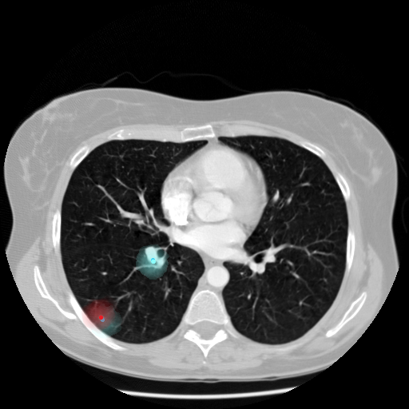

# CedMD: Crowd enhanced deeplearning medical diagnosis (for lung nodule detection)
Lung cancer is the leading cause of cancer deaths, claiming 2 million lives per year. Early diagnosis will help the patient undertake the required treatment and improve quality of life. Traditionally, doctors and radiologists look at computed tomography (CT) scans to find if any cancerous tumors exist. However, given the large amount of data, this is not scalable and we need a secondary screening tool to analyse such clinical data. With the advent of Deep Learning, many computer aided diagnostic (CAD) systems have been developed for nodule detection and nodule classification tasks. These models are created using 3D Convolutional Neural Networks (CNNs) as the primary building blocks. However, since the amount of training data to train a CNN model is quite small (only 1000 scans), the number of False positives in the predictions of such models is very high. Also, it is expensive and time-consuming to manually annotate a large-scale medical dataset. 
Therefore, we look at a crowdsourcing approach to annotate lung nodules in CT scan slices. Since this is a challenging tasks with the need for medical domain knowledge to accurately identify and annotate nodules, we conduct different crowdsouring experiments with different design hyperparameters to decide the optimal parameters to conduct this task successfully. Each experiment has 20 annotators detecting tumors in each subtask. Since, multiple workers are annotating tumors in each subtask, we have developed a crowd agreement methodology to generate points of interest where crowd agrees that a potential tumor exists.

We have developed a end-to-end crowdsourcing pipeline for deep learning model to detect lung nodules accurately. For this project, we use the LUNA16 dataset. We use a model like DeepLung (Zhu W. 2018) to compare models trained with crowdsourced annotations vs expert annotations. The pipeline is shown in Figure 1 

##Stage1 : Determining optimal design hyperparameters to conduct lung nodule annotation tasks using crowdsourcing

The methodology for stage 1 is shown in Figure 2  

### Sampling a subset for crowdsourcing experiments

For sampling the dataset needed for the experiments, we study the nodule features which are annotated by radiologits in the LIDC-IDRI dataset to determine the most significant feature for sampling. In the sampling folder, run Nodule_characteristics.ipynb to understand the different physical characteristics of the nodules. From the characteristics, obtain the correlation heatmap by running the correlation.py script.

 Since we want a balanced dataset for the experiments, we choose 20 nodule containing scans, by runnning Sample_positive_slices.ipynb in the Positive_sample_creation folder. Similarly, negative samples (without tumors) are selected by running Negative_samples.ipynb in the Negative_sample_creation folder.

To retrive the data related to the chosen scans, run retrieve_sample_images.py.

###Preprocessing

The preprocessing is performed for the entire LUNA16 dataset here. For every tumor center, 5 slices around the tumor are retrieved. To obtain the unsegmented slices, run Unsegmentedscans-seq.ipynb. To obtain the segmented slices, run segmentation-tumorwise.ipynb.

### Experiments

Four experiments were conducted using the crowd with point of interest annotation to mark the nodule center. The presentation of each microtask in the experiment is shown in Figure  .

###Analysis and Crowd agreement

Run the MIA_AnnotationAnalysis.ipynb to check the performance of the experiments. The script discards low quality annotations using timestamps and number of tumor indicating annotations and performs crowd agreement with the set of quality annotations per image using DBSCAN algorithm. Worker-wise performance for each experiment is also analysed. The result of crowd agreement positions and expert annotated position are shown in Figure  .The blue points are generated by our algorithm and the red points are expert annotations.
